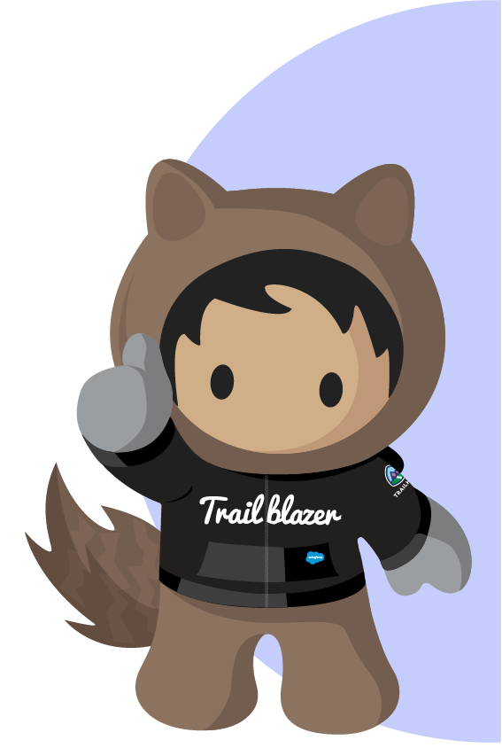

<h2 align="left">Hi, I'm Claire  </h2>
<h4 align="left">Product Analyst and Salesforce Developer 👩‍💻 </h4>

📚 I’m currently learning Apex, JavaScript, HTML, CSS @ [Cloud Code Academy](https://cloudcodeacademy.com)

🏅 [3x Certified Salesforce Professional](https://www.salesforce.com/trailblazer/clairetorrez)

# <h3 align="left">  Salesforce Technologies</h3>
<table width="90%" style="border:0px;">
  <tr style="border:0px;" >
    <td align="center" style="border:0px;">
        
         
        <b>Apex</b>
    </td>
    <td align="center" style="border:0px;"> <b>Integrations</b></td>
    <td align="center" style="border:0px;"> <b>LWC</b></td>
    <td align="center" style="border:0px;"> <b>SFDX</b></td>
    <td align="center" style="border:0px;"> <b>SOQL</b></td>
    <td align="center" style="border:0px;"> <b>Testing</b></td>
  </tr>
</table>

# <h3 align="left">  Salesforce Credentials</h3>

 
  
  
  

# <h3 align="left">  Tech Stack</h3>

|  |  |  |
|:---:|:---:|:---:|
|  |  |  |
|  |  |  |
|  |  |

<!-- Proudly created with GPRM ( https://gprm.itsvg.in ) -->
